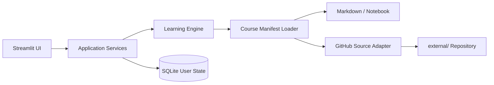

# Learning OS 구현 Plan

- 문서 상태: Phase 2 Implemented v1
- 기준일: 2026-08-30
- 대상 릴리스: Phase 1 Usable MVP → Phase 2 Full Product

## 1. 실행 목표

Learning OS의 첫 번째 목표는 제품을 많이 만드는 것이 아니라, 사용자가 `start.bat`을 실행하고 AICE Associate와 PSPO I 학습을 바로 시작해 진도를 안전하게 남기는 것이다.

Phase 1은 아래 10개 완료 조건이 통과하는 즉시 끝낸다.

1. `start.bat`으로 앱이 실행된다.
2. 브라우저에서 Learning OS가 열린다.
3. AICE Associate, PSPO I, Microsoft AI-For-Beginners가 표시된다.
4. 오늘의 학습이 표시된다.
5. 로컬 Markdown Lesson을 열람할 수 있다.
6. AICE Jupyter Notebook을 열 수 있다.
7. AI-For-Beginners 원본 Lesson 또는 Notebook에 접근할 수 있다.
8. Lesson 완료를 기록할 수 있다.
9. 완료 상태가 SQLite에 저장된다.
10. 앱을 재실행해도 완료 상태가 유지된다.

UI polishing, Quiz, Analytics, AI Tutor는 이 게이트를 늦추지 않는다.

## 2. 범위 원칙과 기본 결정

### 2.1 고정 원칙

- Learning Engine과 Learning Content를 분리한다.
- Course별 분기를 Core 코드에 넣지 않는다.
- Course는 `course.yaml`과 콘텐츠 파일 추가만으로 등록할 수 있게 한다.
- Manifest와 콘텐츠 파일을 Course 구조의 진실의 원천으로 둔다.
- SQLite는 진도, 학습 세션, 설정 등 사용자 상태의 진실의 원천으로 둔다.
- Phase 1에서는 ORM을 쓰지 않고 Python 표준 `sqlite3`와 명시적 SQL migration을 사용한다.
- Core는 AI API 없이 완전히 작동해야 한다.
- 외부 콘텐츠 장애가 다른 Course의 실행을 막지 않게 한다.
- `data/`의 사용자 데이터는 Git에 커밋하지 않는다.

### 2.2 Phase 1에서 의도적으로 하지 않는 것

- 로그인, 멀티유저, 클라우드 동기화
- Quiz/Mock Exam/Spaced Repetition
- Skill mastery 계산과 Knowledge Map
- Notes, 검색, Analytics
- AI Tutor와 유료 API 연동
- PDF/EPUB/URL 범용 importer
- 고급 일정 최적화
- 완성형 Course 콘텐츠 제작

### 2.3 실행 환경 default

- Python 3.11 이상을 기준으로 한다.
- 첫 실행 때 `start.bat`/`start.sh`가 `.venv`를 확인하고, 없으면 생성한 뒤 고정된 requirements를 설치한다.
- 이후 실행은 같은 virtual environment를 재사용한다.
- Python 자체가 없거나 package 설치가 실패하면 조용히 종료하지 않고 필요한 조치를 출력한다.
- Jupyter는 AICE 실습의 필수 runtime dependency로 포함한다.

## 3. MVP 아키텍처



의존 방향은 UI → Application Service → Core/Repository로 한정한다. Course 콘텐츠나 외부 연동이 Core를 역참조하지 않게 한다.

### 3.1 제안 디렉터리

```text
learning_os/
├─ app.py
├─ pyproject.toml
├─ requirements.txt
├─ start.bat
├─ start.sh
├─ src/learning_os/
│  ├─ config.py
│  ├─ core/
│  │  ├─ models.py
│  │  ├─ manifests.py
│  │  ├─ catalog.py
│  │  └─ today.py
│  ├─ database/
│  │  ├─ connection.py
│  │  ├─ migrations.py
│  │  └─ progress_repository.py
│  ├─ integrations/
│  │  ├─ content_loader.py
│  │  ├─ github_source.py
│  │  └─ notebook_launcher.py
│  ├─ services/
│  │  ├─ learning_service.py
│  │  └─ source_service.py
│  └─ ui/
│     ├─ dashboard.py
│     ├─ today.py
│     ├─ courses.py
│     └─ components.py
├─ courses/
│  ├─ aice-associate/
│  ├─ pspo-i/
│  ├─ ai-for-beginners/
│  └─ sqld/
├─ external/
├─ data/
├─ migrations/
├─ tests/
└─ docs/
```

`external/`, `data/*.db`, `.env`, notebook checkpoints는 `.gitignore`에 넣는다. 빈 디렉터리는 `.gitkeep`만 추적한다.

## 4. 핵심 인터페이스

### 4.1 Course Manifest

모든 Course는 동일한 loader를 통과한다. Phase 1 schema는 다음 구조를 지원한다.

```yaml
schema_version: 1
id: aice-associate
title: AICE Associate
description: 데이터 분석과 AI 기초를 실습 중심으로 학습한다.
category: certification
source_type: local
status: active
schedule:
  start_date: 2026-08-30
  target_date: 2026-10-31
  exam_date: 2026-10-31
  estimated_hours: 60
  weekly_target_hours: 8
  priority: 90
prerequisites: []
skills: [python, pandas, machine-learning]
content_sources:
  - id: local-content
    type: local
    base_path: .
quiz_settings: null
completion_criteria:
  type: all_required_lessons
modules:
  - id: python-foundations
    title: Python Foundations
    order: 1
    lessons:
      - id: pandas-basics
        title: Pandas Basics
        type: markdown_notebook
        duration_minutes: 30
        content_path: lessons/pandas-basics.md
        notebook_path: notebooks/pandas-basics.ipynb
        required: true
        skills: [python, pandas]
```

Loader는 필수 필드, ID 유일성, 상대 경로 안전성, 지원 type, 참조 파일 존재 여부를 검증한다. 오류가 있는 Course만 disabled 상태로 반환하고 나머지 Catalog는 유지한다.

### 4.2 MVP 사용자 상태 schema

Migration은 순서가 있는 SQL 파일로 관리하고 앱 시작 때 트랜잭션으로 적용한다.

| Table | 목적 | 주요 필드 |
|---|---|---|
| `schema_migrations` | 적용된 DB 버전 | `version`, `applied_at` |
| `course_registrations` | 발견된 Manifest 식별 | `course_id`, `schema_version`, `manifest_hash`, `last_seen_at` |
| `lesson_progress` | Lesson별 상태 | `course_id`, `lesson_id`, `status`, `started_at`, `completed_at`, `last_opened_at` |
| `study_sessions` | 학습 실행 기록 | `id`, `course_id`, `lesson_id`, `started_at`, `ended_at`, `duration_minutes` |
| `source_repositories` | GitHub source 상태 | `source_id`, `course_id`, `repo_url`, `local_path`, `commit_sha`, `last_sync_at`, `status`, `error_message` |
| `settings` | 로컬 사용자 설정 | `key`, `value_json`, `updated_at` |

`lesson_progress`의 `(course_id, lesson_id)`는 unique다. 완료 처리는 idempotent upsert로 구현한다. SQLite foreign key는 활성화하되 Course/Lesson 원문 전체를 DB에 복제하지 않는다.

Phase 2에서 `skills`, `course_skills`, `lesson_skills`, `quiz_questions`, `quiz_attempts`, `reviews`, `notes`를 migration으로 추가한다.

### 4.3 오늘의 학습 v1

Phase 1은 예측 모델이나 weakness 계산 없이 재현 가능한 규칙을 사용한다.

1. 사용자가 Courses에서 선택한 `status: active` Course만 후보로 둔다.
2. 완료되지 않은 required Lesson 중 Course별 첫 Lesson을 찾는다.
3. Course priority 내림차순, target date 오름차순으로 정렬한다.
4. 선택 시간 안에서 가능한 Lesson을 최대 3개 배치한다.
5. 선택 시간이 없으면 기본 60분을 사용한다.
6. 어떤 Lesson도 정확히 맞지 않으면 가장 짧은 첫 Lesson 하나를 제안한다.

복습, confidence, weakness 기반 재배치는 Phase 2에서 같은 interface 뒤에 추가한다.

### 4.4 콘텐츠 처리

- Markdown: UTF-8로 읽어 Streamlit Markdown renderer에 전달한다.
- Notebook: 존재 여부를 먼저 검증하고 `python -m jupyter lab <notebook>`을 별도 프로세스로 실행한다.
- GitHub: 공식 URL, 선택 branch, sparse path를 Manifest에서 읽는다.
- 외부 source가 없으면 clone/sync 액션과 명확한 오류 상태를 보여준다.
- Git 실행 실패나 네트워크 실패는 `source_repositories`에 기록하고 해당 Course에만 영향을 준다.

## 5. 초기 콘텐츠 최소 범위

| Course | MVP 제공 범위 |
|---|---|
| AICE Associate | Course overview, Python/Pandas 첫 Lesson, 실행 가능한 Pandas basics Notebook |
| PSPO I | Course overview, Scrum Theory/Scrum Values 첫 Lesson, 독창적 scenario 예시 1개 |
| Microsoft AI-For-Beginners | 공식 GitHub source metadata, source 준비/갱신, 첫 원본 Lesson 또는 Notebook 연결 |
| SQLD | 비활성 또는 planned 상태의 Manifest skeleton과 Course 목록 표시 |

AICE와 PSPO 콘텐츠는 공개 syllabus와 공식 가이드를 바탕으로 직접 작성한다. 실제 시험 문항은 복제하지 않는다. Microsoft repository 콘텐츠는 복사하지 않고 원본 repository와 license를 유지한다.

Phase 2 콘텐츠 확장 결과는 다음과 같다.

| Course | 완성 범위 |
|---|---|
| AICE Associate | 5개 모듈, 17개 Lesson, 실행 가능한 Notebook 2개, 출처가 연결된 독창 문항 28개 |
| PSPO I | 공식 12개 Focus Area, 7개 모듈, 16개 Lesson, 출처가 연결된 독창 문항 80개와 full mock |
| English — CEFR A1 to C2 | 36문항 단계 진단, A1~C2별 실용 Lesson 2개, 진단 기반 학습 경로 |
| 중국어 — 입문부터 HSK 9까지 | 50문항 단계 진단, 입문·HSK 1~9별 실용 Lesson 2개, 진단 기반 학습 경로 |
| NCS 직업공통능력 | 2026년 7개 영역 이론, 회차별 50문항·60분 종합 모의고사 10회 |

모든 Course는 시험 범위 암기에 그치지 않는다. AICE는 재현 가능한 tabular ML pipeline을 실행하고, PSPO는 제품 방향·가치 검증·Backlog·예측·이해관계자 의사결정 산출물을 작성한다. 외국어는 녹음·작문·상황 수행 과제를 포함하고, NCS는 계산과 직무 판단의 근거를 설명하며 오답을 분류한다.

## 6. 실행 순서

### Step 0 — Bootstrap과 계약 고정

- Git repository와 Python project를 초기화한다.
- `requirements.txt`, `.gitignore`, 기본 README를 만든다.
- Manifest schema v1, Python domain model, DB migration v1을 Main Agent가 확정한다.
- 공유 interface 변경은 이후 Main Agent만 승인한다.

완료 조건: 빈 앱 startup smoke test와 schema/manifest 계약이 준비된다.

### Step 1 — 병렬 구현

공유 계약이 고정된 뒤 아래 작업을 병렬로 진행한다. 현재 실행 환경의 동시 작업 한도에 맞춰 batch로 투입한다.

| 역할 | Ownership | Phase 1 산출물 |
|---|---|---|
| Agent A — Core Engine | `src/learning_os/core/**`, `src/learning_os/database/**`, `migrations/**` | Manifest loader, catalog, progress repository, Today v1 |
| Agent B — AICE | `courses/aice-associate/**` | 첫 Lesson과 실행 가능한 Notebook |
| Agent C — PSPO | `courses/pspo-i/**` | Scrum Theory/Values Lesson과 scenario 예시 |
| Agent D — GitHub Integration | `src/learning_os/integrations/github_source.py`, `courses/ai-for-beginners/**` | clone/sync/status, 원본 콘텐츠 mapping |
| Agent E — UI | `app.py`, `src/learning_os/ui/**` | Dashboard, Today, Course list, Lesson viewer, complete action |
| Agent F — QA | `tests/**` | unit/integration/startup/persistence regression test |

Main Agent는 `config.py`, shared model/interface, dependency 변경, integration, review를 소유한다. Agent끼리 ownership 밖의 파일은 수정하지 않는다.

### Step 2 — 통합

통합 순서는 다음과 같다.

1. Core/DB
2. Local Course 콘텐츠
3. Dashboard/Today/Course/Lesson UI
4. Notebook launcher
5. GitHub source
6. Startup scripts
7. 통합 테스트와 문서

각 단위는 Implement → Test → Review → Commit 순으로 합친다. `main`은 언제나 실행 가능한 상태를 유지한다.

### Step 3 — MVP 검증

자동 검증:

- DB 최초 생성과 migration 재실행
- 정상/비정상 Manifest loading
- Lesson path validation
- 완료 upsert와 앱 재시작 후 persistence
- source unavailable 격리
- Streamlit startup smoke test
- Windows launcher smoke test

수동 검증:

1. 깨끗한 환경에서 `start.bat` 실행
2. 세 활성 Course 확인
3. 오늘의 학습에서 첫 Lesson 시작
4. AICE Markdown과 Notebook 열기
5. PSPO Lesson 열고 완료
6. AI-For-Beginners source 준비 후 원본 콘텐츠 열기
7. 앱 종료 및 재실행
8. 완료 상태와 progress 확인

10개 완료 조건이 모두 통과하면 Phase 1을 종료하고 새 기능을 넣지 않는다.

### 권장 2~4시간 timebox

| 경과 시간 | 작업 | Gate |
|---|---|---|
| 0:00~0:25 | Bootstrap, schema/interface 고정 | 앱 skeleton과 계약 test |
| 0:25~1:40 | Core/DB, UI, AICE/PSPO 콘텐츠, GitHub adapter 병렬 구현 | 각 ownership unit test |
| 1:40~2:30 | 통합, Notebook, startup scripts | end-to-end 학습 흐름 |
| 2:30~3:20 | persistence/source failure/Windows regression | automated tests green |
| 3:20~4:00 | 수동 AT-01~10, README, MVP 보고 | release gate 통과 |

시간이 부족하면 Phase 2 기능이나 UI 개선을 제거한다. 데이터 무결성, 실행, Lesson 접근은 줄이지 않는다. 외부 네트워크나 package 설치가 장시간 막히면 원인과 재현 절차를 남기되 AT-07을 통과하기 전에는 MVP 완료로 선언하지 않는다.

## 7. MVP 이후 실제 사용 절차

첫 학습일인 2026-08-30의 기본 제안은 다음과 같다.

- AICE Associate: Pandas Basics, 30분
- PSPO I: Scrum Theory와 Scrum Values, 25분
- Microsoft AI-For-Beginners: Introduction lesson, 20분

시간이 30분이면 AICE 또는 마감이 더 가까운 PSPO 중 우선순위가 높은 Lesson 하나만 배치한다. 매일 최소 한 개 Lesson 완료를 제품의 기본 행동으로 둔다.

## 8. Phase 2 Roadmap

Phase 2는 실사용 피드백을 우선 반영하되 기본 순서는 아래와 같다.

| 순서 | Epic | 완료 판단 |
|---:|---|---|
| 1 | Quiz Engine | Course 독립 문항 schema, 응답/정확도/confidence 저장 |
| 2 | Spaced Repetition | 1/2/4/7/14/30일 규칙과 복습 퀴즈 |
| 3 | PSPO Scenario Practice | 정답·오답 근거와 Scrum principle 제공 |
| 4 | AICE Practice Validation | Notebook 연습과 재현 가능한 answer check |
| 5 | Curriculum Scheduler | 시험일, 시간, 우선순위, 진도 기반 일정 |
| 6 | Mock Exam | Course별 시험 profile과 topic 분석 |
| 7 | Weak Point Analytics | 오답·confidence·속도 기반 취약 topic |
| 8 | Knowledge/Skill Map | Course completion과 분리된 mastery |
| 9 | Notes/Knowledge Base | Markdown note와 전체 검색 |
| 10 | AI Tutor | optional provider abstraction |
| 11 | Generic Course Import | local/GitHub를 넘어 PDF/URL 확장 |
| 12 | Language Support | vocabulary/reading/listening/speaking 등 lesson type |
| 13 | Adaptive Placement | Manifest 기반 단계 진단, 권장 시작점 저장, 학습 경로 필터 |
| 14 | Fixed Mock Sets | NCS 10회×50문항 고정 세트, 회차 선택과 최근 점수 저장 |
| 15 | Course Selection Flow | 선택 Course만 오늘의 학습·복습에 노출, 선택값 로컬 저장 |

각 Epic은 별도 migration과 기존 MVP regression test를 포함한다. P0 오류가 있으면 Phase 2 기능보다 먼저 고친다.

## 9. 리스크와 대응

| 리스크 | 영향 | 대응 |
|---|---|---|
| Course schema를 너무 크게 설계 | MVP 지연 | v1 필수 필드만 검증하고 확장 필드는 optional 처리 |
| GitHub/network 장애 | 외부 Course 학습 불가 | Course 단위 오류 격리, retry/sync, 마지막 정상 상태 표시 |
| Notebook 실행 환경 차이 | 실습 시작 실패 | 현재 Python의 `-m jupyter lab` 사용, 경로 quote, Windows/macOS/Linux test |
| Manifest ID 변경 | 기존 진도 고아화 | 공개 후 `course_id`/`lesson_id` 불변 정책, 변경 시 migration 제공 |
| DB 손상/사용자 데이터 손실 | 신뢰 상실 | 트랜잭션, WAL, timestamped backup, restore test를 우선 구현 |
| 콘텐츠 제작이 개발을 잠식 | 학습 지연 | MVP는 첫 학습 세트만 제공하고 이후 실제 학습 흐름에서 확장 |
| 저작권/시험 정책 위반 | 배포·사용 위험 | 공개 출처와 독창 문항만 사용하고 source/license metadata 유지 |

## 10. Phase 1 Definition of Done

- PRD의 P0 기능 요구사항과 10개 acceptance test가 모두 통과한다.
- automated test suite가 통과한다.
- secrets와 사용자 DB가 Git 추적 대상이 아니다.
- Windows 실행법과 제한사항이 README에 있다.
- 앱 실패가 Course 단위로 격리되고 오류 메시지가 행동 가능한 형태다.
- 오늘 바로 시작할 AICE/PSPO Lesson이 존재한다.
- 완료 보고 후 개발을 멈추고 사용자가 학습을 시작하게 한다.

## 11. Phase 2 Release Gate

| ID | 완료 조건 | 구현/검증 |
|---|---|---|
| P2-01 | v1 DB를 손실 없이 upgrade | migration `002_phase2_learning.sql`, migration 회귀 테스트 |
| P2-02 | Course 독립 Quiz와 confidence 저장 | 4개 `questions.yaml`, 118문항 loader, `quiz_attempts` |
| P2-03 | 1/2/4/7/14/30일 Review | `schedule_review`, 규칙 parameterized test |
| P2-04 | Practice/Mock Exam | Course profile, session/attempt 저장, 결과 UI |
| P2-05 | Curriculum Scheduler | deadline·priority·progress·weakness와 사용자 계획 조정 |
| P2-06 | Weak Point Analytics | topic 정확도·자신감·응답시간·취약도 |
| P2-07 | Skill mastery | Quiz·confidence·Lesson·Review 근거와 계산 설명 |
| P2-08 | Notes/Search | Lesson Note, Markdown/URL, 전체 검색 |
| P2-09 | Settings/Backup | 학습 시간·언어 저장, checksum·integrity restore |
| P2-10 | optional AI Tutor | `AIProvider` Protocol과 disabled default |
| P2-11 | Generic Import | URL/PDF/Markdown → Manifest Course |
| P2-12 | Language 확장 | ko/en 필터와 url/pdf/vocabulary/listening/speaking type |
| P2-13 | Course 선택 흐름 | `selected_course_ids` 설정과 오늘의 학습·복습 공통 필터 |

모든 Phase 1 regression test를 함께 통과하고 실제 브라우저에서 Courses 선택 → 오늘의 학습 → Quiz → 복습 → Insights 흐름을 확인해야 Phase 2를 완료로 본다.
